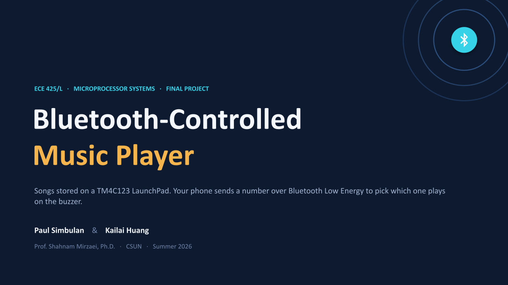
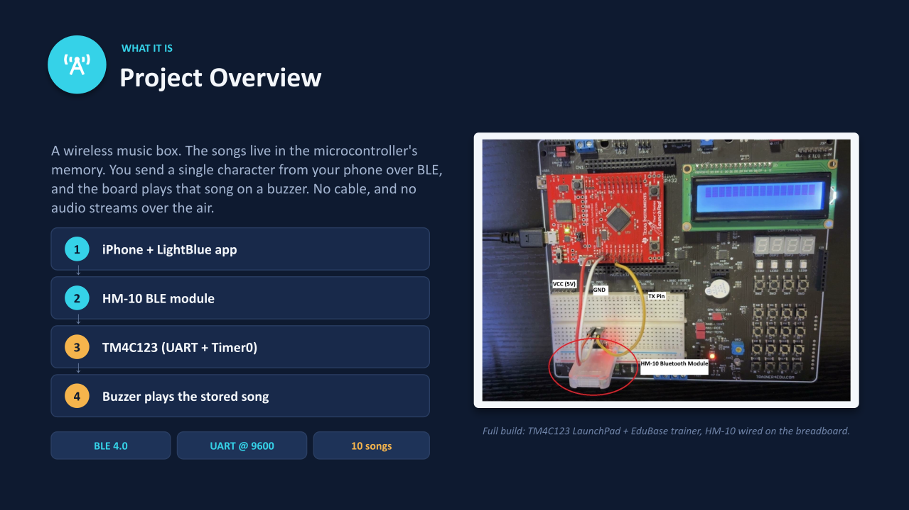
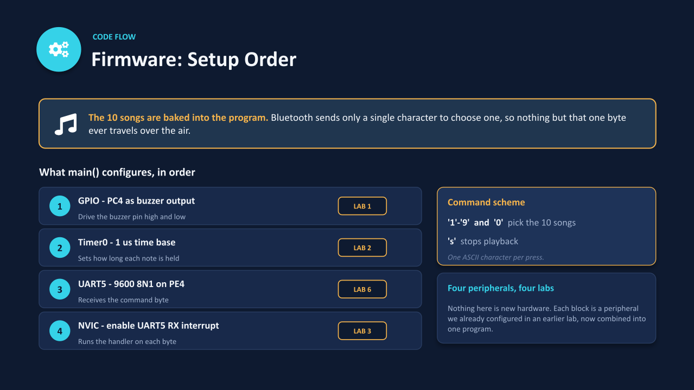
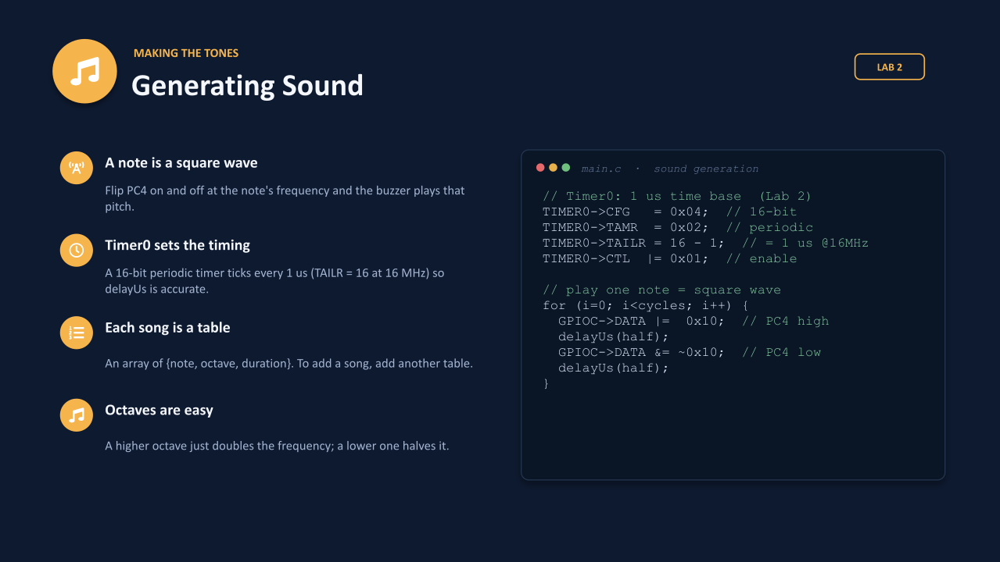
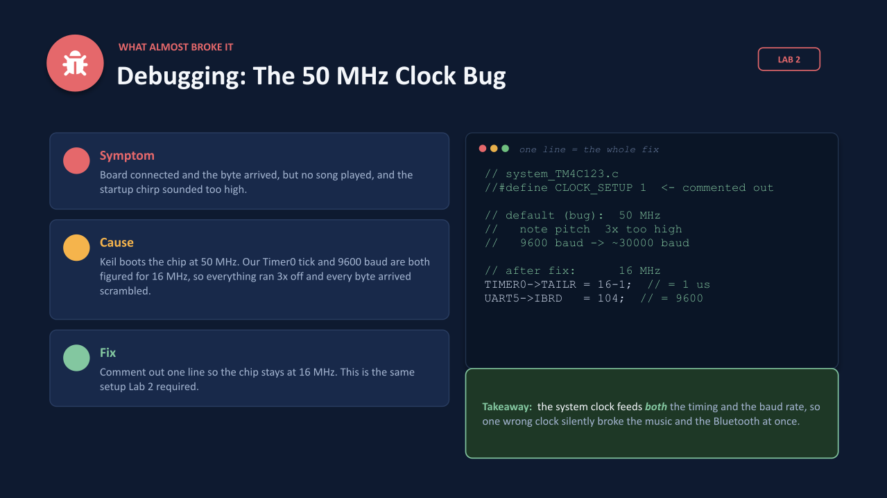

# Bluetooth-Controlled Music Player

My final assignment for ECE 425 Microprocessor Systems at CSUN, built with Kailai Huang in Summer 2026. Ten songs live on a TI TM4C123 LaunchPad. A phone sends one character over Bluetooth Low Energy, and the board plays that song on a buzzer.



ECE 425 was my first embedded class: bare-metal C on an ARM Cortex-M4, writing straight to registers in Keil, with no operating system and no vendor library. For the final assignment each team picked its own topic. We combined two ideas from the class list, a music box and a Bluetooth link, and tied together what we had learned in the labs. It is a small assignment, and it was the first time all the pieces worked together in one program.



| | |
|---|---|
| **Board** | TI TM4C123GH6PM LaunchPad on the EduBase-V2 trainer |
| **Wireless** | HM-10 BLE module (TI CC2541), transparent BLE to UART bridge |
| **Phone app** | LightBlue on iPhone, writes one UTF-8 character |
| **Link** | UART5 at 9600 8N1, HM-10 TXD to PE4 (U5RX) |
| **Sound** | Buzzer on PC4, square waves timed by Timer0 |
| **Clock** | 16 MHz default clock (`CLOCK_SETUP` commented out) |
| **Tools** | Keil uVision, CMSIS `TM4C123GH6PM.h` |

## Commands

| Key | Song | Key | Song |
|---|---|---|---|
| `1` | Happy Birthday | `6` | Fur Elise |
| `2` | Twinkle Twinkle | `7` | When the Saints Go Marching In |
| `3` | Ode to Joy | `8` | Row Row Row Your Boat |
| `4` | Mary Had a Little Lamb | `9` | Frere Jacques |
| `5` | Jingle Bells | `0` | The Entertainer |

`s` stops the current song. Sending a new key in the middle of a song switches to it.

## Why the HM-10

The class idea list suggested an HC-05. That module only does Bluetooth Classic, which iPhone apps cannot use. The HM-10 is Bluetooth Low Energy, so it works with iOS through an app like LightBlue. The board never replies, so only the HM-10's TX line is wired.

## How it works

| Setup order | Making the tones |
|---|---|
|  |  |

- **Each piece comes from a lab.** GPIO for the buzzer (Lab 1), Timer0 for timing (Lab 2), interrupts and the NVIC (Lab 3), and UART (Lab 6).
- **A note is a square wave.** PC4 toggles high and low at the note's frequency. Timer0 is a 16-bit periodic timer that ticks every 1 us, and `delayUs()` counts those ticks.
- **Songs are tables.** Each song is an array of `{pitch, octave, duration}`. A higher octave doubles the frequency, a lower one halves it. Each note sounds for 90% of its length so repeated notes stay separate.
- **UART5 at 9600 baud.** 16 MHz / (16 x 9600) = 104.17, so `IBRD = 104` and `FBRD = 11`.
- **The ISR stays short.** `UART5_Handler` reads the byte, stores it in a `volatile` variable and returns. The main loop picks the song.
- **Switching mid-song.** `playSong()` checks for a new command before every note.

## What broke



- **Right byte, no song, and a chirp that sounded too high.** Keil's startup file sets the chip to 50 MHz, but our Timer0 tick and baud math assumed 16 MHz. Pitch and baud rate were both off by about 3x, so every byte arrived scrambled. Commenting out `#define CLOCK_SETUP 1` in `system_TM4C123.c` fixed both at once. One clock setting can break two things that look unrelated.
- **An interrupt that never stopped firing.** The UART shares one interrupt line for receive, timeout, overrun and framing errors. Clearing only the RX flag left another flag set, so the handler kept running and `main()` never got to play anything. Now the handler clears every UART flag with `ICR = 0x7F0`.

## Looking back

This was written before I knew much embedded, and it shows. Delays are busy-wait loops, so the CPU does nothing else while a note plays. Tones are toggled in software instead of with a hardware PWM or timer interrupt, and the note math uses floats. Those are the things I learned to do differently in my later work: [ESP32-S3 firmware labs](https://github.com/pajsimbulan/esp32s3-firmware-lab) and Oscil.

## Repo layout

```
firmware/main.c                     all of the firmware
docs/slides/                        the presentation, one SVG per slide
docs/ECE425_Project_Presentation.pptx
docs/Project_Proposal.pdf
```

## Build

1. Create a Keil uVision project for the TM4C123GH6PM and add `firmware/main.c`.
2. In `system_TM4C123.c`, comment out `#define CLOCK_SETUP 1` so the chip runs at 16 MHz.
3. Wire HM-10 VCC to 5 V, GND to GND, TXD to PE4. Buzzer on PC4 (on the EduBase board).
4. Build, flash, and listen for the two-note startup chirp.
5. In LightBlue, connect to the HM-10, set the write format to UTF-8 and write `1`.

Special thanks to Dr. Shahnam Mirzaei for the class and to my partner Kailai Huang.
